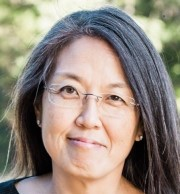

 
## Deborah Tylor, Owner of Tylor Data Services, LLC
More than 20-years of professional experience in the fields of development and data analysis, software architecture, project management, technical leadership, including training for government and commercial industries. Deborah also provides innovative software solutions to solve complex business and analytical requirements, uses sound problem solving and communication skills to translate analyst needs into technical solutions.  

B.A. Physics and B.E. Environmental Engineering, Dartmouth College 

M.S. Physical Oceanography, University of Hawaii, SOEST (results from research were published in the Journal of Physical Oceanography).

Deborah is a proud mother and wife and active member at our local, Catholic parish.
---

## Joseph Haaga, Data Scientist
Software designer and web developer with a data science knowledge base. 

B.S. Computer Science, George Washington University

---

## Sook Seo, Data Analyst
An ex-Wall Streeter with a desire to make a difference and make things better. 

B.S. Accounting, University of Maryland University College

B.A. English, University of Chicago
